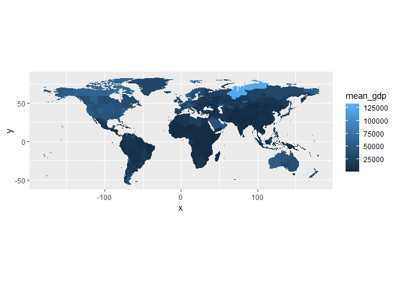
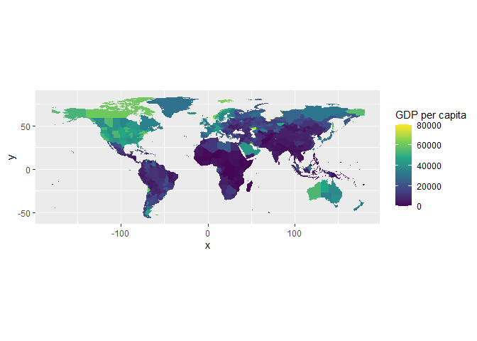

Code
================

# Income Data, cell-level

## Kummu (2018) - Gridded global datasets for Gross Domestic Product and Human Development Index over 1990-2015

Source: <https://doi.org/10.5061/dryad.dk1j0>

Peri (2019) uses cell-level data for income to split observations into 4
income groups (poor, mid-poor, mid-rich, rich). However, two drawbacks:

- low frequency, 10 years intervals between 1980 and 2100
- low resolution, 0.5° (= 30 arc-min,
  <https://www.inchcalculator.com/convert/degree-to-arcminute/>)

Kummu (2018) has built a finer global gridded dataset for HDI, GPD, and
GDP per capita, at PPP and USD2011, with:

- higher frequency, yearly over 1990-2015
- higher resolution, 0.083° (= 5 arc-min, 6 times more detailed)

Goal: distribute cells based on their GPD per capita into 4 percentiles
(25th, 50th, 75th). To do so:

1)  Long-run income average for all cells, 2000-2015
2)  Assign percentiles

Making income percentile at cell-level and not using country-level data
(eg. from World Bank) allows me to keep taking advantage of the fine
spatial resolution, capturing within-country variation.

Handling NetCDF files in R: - <https://rdrr.io/cran/ncdf4/man/> -
<https://pjbartlein.github.io/REarthSysSci/netCDF.html>

**RESAMPLING**! Climate data are in 6 arcmin (0.1°). Therefore I need to
resample Income data first, from 5 arcmin (0.083°) to 6 arcmin! Loss in
resolution is not drastic and the aggregation helps in reducing data
complexity.

``` r
library(terra)
```

    ## Warning: package 'terra' was built under R version 4.4.3

    ## terra 1.8.29

``` r
library(ncdf4)

filepath_GDP_per_capita_PPP_1990_2015_v2 <- "../data/GDP_per_capita_PPP_1990_2015_v2.nc"
r_gdp <- rast(filepath_GDP_per_capita_PPP_1990_2015_v2)

r_gdp
```

    ## class       : SpatRaster 
    ## dimensions  : 2160, 4320, 26  (nrow, ncol, nlyr)
    ## resolution  : 0.08333333, 0.08333334  (x, y)
    ## extent      : -180, 180, -90, 90  (xmin, xmax, ymin, ymax)
    ## coord. ref. : +proj=longlat +datum=WGS84 +no_defs 
    ## source      : GDP_per_capita_PPP_1990_2015_v2.nc 
    ## varname     : GDP_per_capita_PPP (Gross Domestic Production (GDP) per capita (PPP)) 
    ## names       :                           GDP_p~PPP_1,                           GDP_p~PPP_2,                           GDP_p~PPP_3,                           GDP_p~PPP_4,                           GDP_p~PPP_5,                           GDP_p~PPP_6, ... 
    ## unit        : constant 2011 international US dollar, constant 2011 international US dollar, constant 2011 international US dollar, constant 2011 international US dollar, constant 2011 international US dollar, constant 2011 international US dollar, ...

``` r
# Select years 2000–2015
r_gdp_sel <- r_gdp[[11:26]]

# Compute mean across years
r_gdp_mean <- mean(r_gdp_sel, na.rm = TRUE)

# Template at 0.1° (6 arcmin) resolution
r_template <- rast(ext(r_gdp_mean), resolution = 0.1, crs = crs(r_gdp_mean))

# Resample to 0.1°
r_gdp_resampled <- resample(r_gdp_mean, r_template, method = "bilinear")

# Convert to data.frame
gdp_avg <- as.data.frame(r_gdp_resampled, xy = TRUE, na.rm = TRUE)
names(gdp_avg)[3] <- "mean_gdp"
```

Let’s see the distribution of the average GDP per capita. Only few
outliers (50k observations) at avg_gdp \> \$125k.

``` r
library(ggplot2)
```

    ## Warning: package 'ggplot2' was built under R version 4.4.3

``` r
# Remove outliers to calculate quantiles
gdp_avg_clean <- gdp_avg[gdp_avg$mean_gdp < 125000, ]

# Quartiles
p <- quantile(gdp_avg_clean$mean_gdp, probs = c(0.25, 0.5, 0.75))

# Histogram
ggplot(gdp_avg, aes(mean_gdp)) +
  geom_histogram() +
  geom_vline(xintercept = p[1], color="red") +
  geom_vline(xintercept = p[2], color="red") +
  geom_vline(xintercept = p[3], color="red") +
  annotate("text", x = p[1], y = 10000, label = "25th", vjust = -2, color = "red") +
  annotate("text", x = p[2], y = 10000, label = "50th", vjust = -2, color = "red") +
  annotate("text", x = p[3], y = 10000, label = "75th", vjust = -2, color = "red") +
  scale_x_continuous(labels = scales::label_comma(), breaks = seq(0, 125000, by=25000))
```

    ## `stat_bin()` using `bins = 30`. Pick better value with `binwidth`.

<!-- -->

Let’s split observations in quartiles. In this way, we can later group
Net-Migration and Climate data in GDP clusters.

``` r
# Cut into quartiles
gdp_avg$gdp_quartile <- cut(
  gdp_avg$mean_gdp,
  breaks = c(-Inf, p, Inf),
  labels = c("Q1", "Q2", "Q3", "Q4"),
  include.lowest = TRUE
)
```

Let’s plot average GDP per capita.

``` r
ggplot(gdp_avg, aes(x=x, y=y, fill=mean_gdp)) +
  geom_tile() +
  coord_fixed() +
  scale_fill_viridis_c(name = "GDP per capita", limits = c(0,125000), oob = scales::squish)
```

<!-- -->

``` r
#ggsave("test.png", units = "px", width = 2000, height = 1500)
```

Let’s plot quartiles on the map. It’s visible how using cell-level data,
instead of country-level, we have within-country variation (and not
corresponding to regional administrative borders).

``` r
ggplot(gdp_avg, aes(x=x, y=y, fill=gdp_quartile)) +
  geom_tile() +
  coord_fixed()
```

<!-- -->

Some Summary Stats

``` r
summary(gdp_avg$mean_gdp)
```

    ##     Min.  1st Qu.   Median     Mean  3rd Qu.     Max. 
    ##    449.2   6390.4  19316.2  26655.9  39673.9 132869.7

Number of cells: 1,5 mln.

``` r
length(gdp_avg$mean_gdp)
```

    ## [1] 1572666

Number of cell in each income group.

``` r
table(gdp_avg$gdp_quartile)
```

    ## 
    ##     Q1     Q2     Q3     Q4 
    ## 389525 376595 376245 430301

Info ORIGINAL raster

``` r
ext(r_gdp_mean)
```

    ## SpatExtent : -179.999994912559, 179.999994912559, -90.0000025443095, 90.0000025443094 (xmin, xmax, ymin, ymax)

``` r
res(r_gdp_mean)
```

    ## [1] 0.08333333 0.08333334

Info RESAMPLED raster

``` r
ext(r_gdp_resampled)
```

    ## SpatExtent : -179.999994912559, 179.999994912559, -90.0000025443095, 90.0000025443094 (xmin, xmax, ymin, ymax)

``` r
res(r_gdp_resampled)
```

    ## [1] 0.1 0.1

This is how the GRID has changed after resampling.

``` r
# Area
region <- ext(10, 11, 50, 51) # lon_min, lon_max, lat_min, lat_max

# Crop
r_gdp_original_crop <- crop(r_gdp_mean, region) # original
r_gdp_resampled_crop <- crop(r_gdp_resampled, region) # resampled

# To data frames
df_original <- as.data.frame(r_gdp_original_crop, xy = TRUE, na.rm = TRUE)
df_resampled <- as.data.frame(r_gdp_resampled_crop, xy = TRUE, na.rm = TRUE)

ggplot() +
  # Original
  geom_tile(data = df_original, aes(x = x, y = y), fill = "black", alpha = .5, color = "black", linewidth = 1) +
  
  # Resampled
  geom_tile(data = df_resampled, aes(x = x, y = y), fill = NA, color = "red", linewidth = 1) +
  
  coord_fixed()
```

<!-- -->

Let’s see the VALUEs.

``` r
library(ggnewscale) # two color scales
```

    ## Warning: package 'ggnewscale' was built under R version 4.4.3

``` r
ggplot() +
  # Original
  geom_tile(data = df_original, aes(x = x, y = y, fill = mean)) +
  scale_fill_viridis_c(name = "GDP original", option = "magma", alpha = .8) +
  
  ggnewscale::new_scale_fill() +  # Enables second fill scale
  
  # Resampled
  geom_tile(data = df_resampled, aes(x = x, y = y, fill = mean), alpha = .5, color = "black", linewidth = .5) +
  scale_fill_viridis_c(name = "GDP resampled", option = "viridis", alpha = 0.6) +
  
  coord_fixed()
```

<!-- -->

Let’s export our final dataset in csv.

``` r
write.csv(gdp_avg, "../data/income-gdp-quarter.csv", row.names = FALSE)
```
