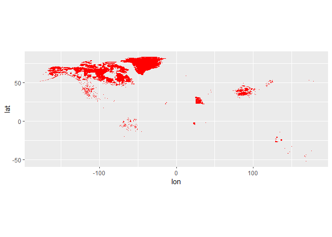
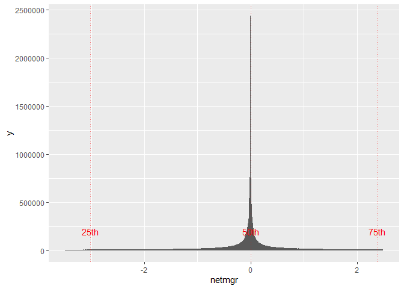
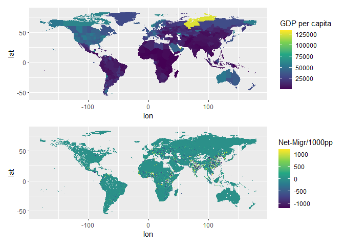
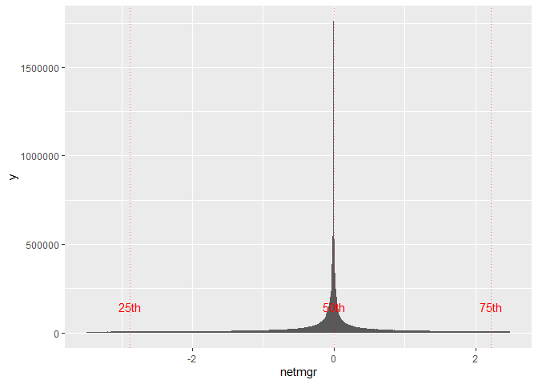
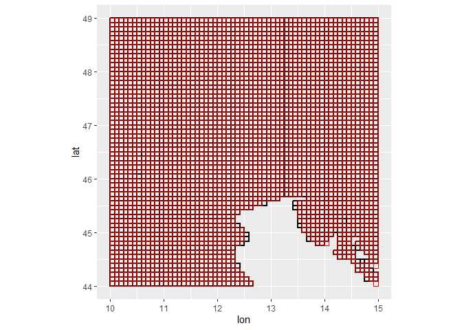
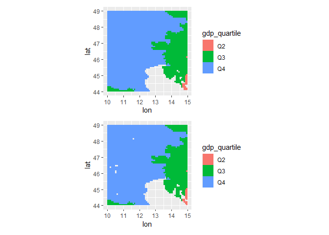

Code
================

# Net-Migration Data, cell level

## Niva (2023) - World’s human migration patterns in 2000–2019 unveiled by high-resolution data

Source: <https://doi.org/10.1038/s41562-023-01689-4>

Code References: - (Context) Spatial Data Science: With Applications in
R: <https://doi.org/10.1201/9780429459016> - (Code) R as GIS for
Economists: <https://tmieno2.github.io/R-as-GIS-for-Economists-Quarto/>

Let’s import the dataset produced by Niva (2023): - Data:
<https://zenodo.org/records/7997134> - Gridded global Net-Migration (per
1000 people) - Yearly 2000-2019 (20 years) - High-resolution, 5 arc-min
/ 0.083° <https://www.inchcalculator.com/convert/degree-to-arcminute/>

``` r
library(terra)
```

    ## Warning: package 'terra' was built under R version 4.4.3

    ## terra 1.8.29

``` r
library(tidyr)
```

    ## Warning: package 'tidyr' was built under R version 4.4.3

    ## 
    ## Attaching package: 'tidyr'

    ## The following object is masked from 'package:terra':
    ## 
    ##     extract

``` r
library(ggplot2)
```

    ## Warning: package 'ggplot2' was built under R version 4.4.3

``` r
library(dplyr)
```

    ## Warning: package 'dplyr' was built under R version 4.4.3

    ## 
    ## Attaching package: 'dplyr'

    ## The following objects are masked from 'package:terra':
    ## 
    ##     intersect, union

    ## The following objects are masked from 'package:stats':
    ## 
    ##     filter, lag

    ## The following objects are masked from 'package:base':
    ## 
    ##     intersect, setdiff, setequal, union

``` r
# Import Net-Migration data, 2000-2019 yearly (20 layers)
filepath_raster_netMgr_2000_2019_annual <- "../data/raster_netMgr_2000_2019_annual.tif"
raster_netMgr_2000_2019_annual <- rast(filepath_raster_netMgr_2000_2019_annual)

raster_netMgr_2000_2019_annual # 2160 * 4320 * 20 years
```

    ## class       : SpatRaster 
    ## dimensions  : 2160, 4320, 20  (nrow, ncol, nlyr)
    ## resolution  : 0.08333333, 0.08333333  (x, y)
    ## extent      : -180, 180, -90, 90  (xmin, xmax, ymin, ymax)
    ## coord. ref. : lon/lat WGS 84 (EPSG:4326) 
    ## source      : raster_netMgr_2000_2019_annual.tif 
    ## names       :      2000,      2001,      2002,      2003,      2004,      2005, ... 
    ## min values  : -245496.2, -137345.0, -130722.1, -106122.1, -114304.3, -235654.8, ... 
    ## max values  :  114237.0,  124515.2,  122075.5,  147669.6,  100850.3,  175273.8, ...

``` r
# Convert to df
df_netMgr_2000_2019_annual <- as.data.frame(raster_netMgr_2000_2019_annual, xy = TRUE) # 2.259.320 obs for 20 years

# From wide (22 columns) to long
df_netMgr_2000_2019_annual_long <- pivot_longer(df_netMgr_2000_2019_annual, -c(x, y), names_to = "layer", values_to = "value") # 45.186.400 obs
colnames(df_netMgr_2000_2019_annual_long) <- c("lon", "lat", "year", "netmgr")

summary(df_netMgr_2000_2019_annual_long$netmgr)
```

    ##      Min.   1st Qu.    Median      Mean   3rd Qu.      Max.      NA's 
    ## -245496.2      -1.4       0.0       0.4       1.0  503042.8       681

Remove missing values.

``` r
# Remove NAs
df_netMgr_2000_2019_annual_long <- df_netMgr_2000_2019_annual_long[!is.na(df_netMgr_2000_2019_annual_long$netmgr),]
```

Many cells (6,7 mln) have value 0. This would imply that natural birth
and death rate perfectly match. Leaving these 0 in the dataset alters
the analysis, and as a perfect match of the demographic rates seems
rather a rare residual case.

I’ve decided to remove the observations with value 0. Here I plot these
observations, they mostly cover Greenland.

``` r
# Zeros
df_zeros <- df_netMgr_2000_2019_annual_long[df_netMgr_2000_2019_annual_long$netmgr == 0,] # Length 6,7mln observations

avg_zeros <- df_zeros %>%
  group_by(lon, lat) %>%
  summarise(m = mean(netmgr, na.rm = TRUE))
```

    ## `summarise()` has grouped output by 'lon'. You can override using the `.groups`
    ## argument.

``` r
ggplot() +
  geom_tile(data = avg_zeros, aes(lon, lat), fill = "red") +
  coord_fixed()
```

<!-- -->

Therefore, let’s remove observations with 0.

``` r
# Remove 0s
df_netMgr_2000_2019_annual_long <- df_netMgr_2000_2019_annual_long[df_netMgr_2000_2019_annual_long$netmgr != 0,] # From 45mln to 38 mln observation

summary(df_netMgr_2000_2019_annual_long$netmgr)
```

    ##      Min.   1st Qu.    Median      Mean   3rd Qu.      Max. 
    ## -245496.2      -3.3       0.0       0.4       2.6  503042.8

Let’s proceed cleaning our dataset, it’s time for outliers. I remove
outliers at 0.01 and 0.99 percentiles.

``` r
p <- quantile(df_netMgr_2000_2019_annual_long$netmgr, probs = c(0.01, 0.99))

# Filter out outliers (1st, 99th percentile)
df_netMgr_2000_2019_annual_long <- df_netMgr_2000_2019_annual_long[
  df_netMgr_2000_2019_annual_long$netmgr >= p[1] &
  df_netMgr_2000_2019_annual_long$netmgr <= p[2], ] # From 38mln to 37mln

summary(df_netMgr_2000_2019_annual_long$netmgr)
```

    ##      Min.   1st Qu.    Median      Mean   3rd Qu.      Max. 
    ## -1200.878    -3.024    -0.001    -2.188     2.383  1192.688

Our Net-Migration dataset is ready. Let’s plot the distribution.

Most observations have values very close to 0. For instance, a value of
0.02, considering values are the ratio between net migration and 1,000
people, means that for every 1,000 residents, there was a net gain of
only 0.02 people, equivalent to just 2 individuals per 100,000 people.
Instead, a value of 1 means that for every 1,000 residents, there was a
net gain of 1 person.

These are RATIOs. In a region with a population of 100,000: - A value of
0.2 would imply a net migration of 20 people (0.2/1000 \* 100k) - A
value of 1 would imply a net migration of 100 people (1/1000 \* 100k)

``` r
pp <- quantile(df_netMgr_2000_2019_annual_long$netmgr, probs = c(0.25, 0.5, 0.75))

ggplot(data = df_netMgr_2000_2019_annual_long, aes(netmgr)) +
  geom_histogram(binwidth = 0.01) +
  xlim(-3.5, 2.5) +
    geom_vline(xintercept = pp[1], color="red", alpha=0.5, linetype="dotted") +
  geom_vline(xintercept = pp[2], color="red", alpha=0.5, linetype="dotted") +
  geom_vline(xintercept = pp[3], color="red", alpha=0.5, linetype="dotted") +
  annotate("text", x = pp[1], y = 10000, label = "25th", vjust = -2, color = "red") +
  annotate("text", x = pp[2], y = 10000, label = "50th", vjust = -2, color = "red") +
  annotate("text", x = pp[3], y = 10000, label = "75th", vjust = -2, color = "red")
```

    ## Warning: Removed 18461817 rows containing non-finite outside the scale range
    ## (`stat_bin()`).

    ## Warning: Removed 2 rows containing missing values or values outside the scale range
    ## (`geom_bar()`).

<!-- -->

Single observations (cell, year) with POSITIVE Net-Migration = 18,1 mln

``` r
df_netMgr_2000_2019_annual_long[df_netMgr_2000_2019_annual_long$netmgr > 0, ]
```

    ## # A tibble: 18,170,753 × 4
    ##      lon   lat year      netmgr
    ##    <dbl> <dbl> <chr>      <dbl>
    ##  1 -74.6  83.1 2003  0.0000302 
    ##  2 -74.6  83.1 2005  0.00000336
    ##  3 -74.6  83.1 2006  0.0000148 
    ##  4 -74.6  83.1 2011  0.00000146
    ##  5 -74.6  83.1 2014  0.0000202 
    ##  6 -74.6  83.1 2016  0.0000228 
    ##  7 -74.6  83.1 2018  0.000183  
    ##  8 -74.5  83.1 2003  0.0000367 
    ##  9 -74.5  83.1 2005  0.0000260 
    ## 10 -74.5  83.1 2006  0.0000341 
    ## # ℹ 18,170,743 more rows

Single observations (cell, year) with NEGATIVE Net-Migration = 19,5 mln

``` r
df_netMgr_2000_2019_annual_long[df_netMgr_2000_2019_annual_long$netmgr < 0, ]
```

    ## # A tibble: 19,505,278 × 4
    ##      lon   lat year       netmgr
    ##    <dbl> <dbl> <chr>       <dbl>
    ##  1 -74.6  83.1 2000  -0.0000322 
    ##  2 -74.6  83.1 2001  -0.0000570 
    ##  3 -74.6  83.1 2002  -0.0000180 
    ##  4 -74.6  83.1 2004  -0.00000878
    ##  5 -74.6  83.1 2007  -0.0000323 
    ##  6 -74.6  83.1 2008  -0.00000540
    ##  7 -74.6  83.1 2009  -0.0000146 
    ##  8 -74.6  83.1 2010  -0.00000341
    ##  9 -74.6  83.1 2012  -0.0000158 
    ## 10 -74.6  83.1 2013  -0.0000185 
    ## # ℹ 19,505,268 more rows

It’s time to merge Income and Net-Migration data.

1.  Both datasets use the same coordinate/projection system: EPSG:4326
    (WGS84) <https://epsg.io/4326>. This is reassuring, as allows us to
    spatially merge the features of the two datasets without having to
    resample.

2.  Both datasets have the same resolution: 0.83° / 5 arc-min
    <https://www.inchcalculator.com/convert/degree-to-arcminute/>

Let’s plot them together.

``` r
# Import clean version of income data
gdp <- read.csv("../data/income-gdp-quarter.csv")

# Net-Migration data for 1 year, to be able to plot
netmgr_1y <- df_netMgr_2000_2019_annual_long[df_netMgr_2000_2019_annual_long$year == 2000,]

library(patchwork)
```

    ## Warning: package 'patchwork' was built under R version 4.4.3

    ## 
    ## Attaching package: 'patchwork'

    ## The following object is masked from 'package:terra':
    ## 
    ##     area

``` r
p1 <- ggplot() +
  geom_tile(data = gdp, aes(x = lon, y = lat, fill = mean_gdp)) +
  coord_fixed() +
  scale_fill_viridis_c(name = "GDP per capita")


p2 <- ggplot() + 
  geom_tile(data = netmgr_1y, aes(x = lon, y = lat, fill = netmgr)) +
  coord_fixed() +
  scale_fill_viridis_c(name = "Net-Migr/1000pp")

p1 + p2 + plot_layout(ncol = 1)
```

<!-- -->

``` r
# Function to filter
filter_continent <- function(grid, lon_min, lon_max, lat_min, lat_max) {
  subset(grid, lon >= lon_min & lon <= lon_max & lat >= lat_min & lat <= lat_max)
}
```

Let’s overlap them to check whether they’re actually using the same grid
system!

First, let’s subset our global dataset and select a small area,
north-east Italy.

``` r
# Subset the area of interest
gdp_subset <- filter_continent(gdp, lon_min = 10, lon_max = 15, lat_min = 44, lat_max = 49)
netmgr_subset <- filter_continent(df_netMgr_2000_2019_annual_long, lon_min = 10, lon_max = 15, lat_min = 44, lat_max = 49)

p3 <- ggplot() +
  geom_tile(data = gdp_subset, aes(x = lon, y = lat, fill = mean_gdp)) +
  coord_fixed() +
  scale_fill_viridis_c(name = "Avg GDP", option = "magma", alpha = 1)

p4 <- ggplot() +
  geom_tile(data = netmgr_subset, aes(x = lon, y = lat, fill = netmgr)) +
  coord_fixed() +
  scale_fill_viridis_c(name = "Net-Migration/1000pp", option = "viridis")

p3 + p4 + plot_layout(ncol = 1)
```

<!-- -->

Let’s overlap the grid of the two areas. They perfectly match! We can
now merge the variables of the two datasets.

``` r
library(ggnewscale) # Library to have multiple legends/scales
```

    ## Warning: package 'ggnewscale' was built under R version 4.4.3

``` r
ggplot() +
  # 1st layer: avg GDP
  geom_tile(data = gdp_subset, aes(x = lon, y = lat), fill = "white", alpha = 0, color="black", size = 1) +
  coord_fixed() +
  scale_fill_viridis_c(name = "Avg GDP", option = "magma") +
  
  new_scale_fill() + # New scale layer
  
  # 2nd layer: Net-Migration/1000pp
  geom_tile(data = netmgr_subset, aes(x = lon, y = lat), fill = "white", alpha = 0, color = "red", size = 0.1) +
  coord_fixed() +
  scale_fill_viridis_c(name = "Net-Migration/1000pp", option = "viridis") +
  
  # Legends position
  theme(
    legend.position = "bottom",  # Place both legends below
    legend.box = "horizontal"
  )
```

    ## Warning: Using `size` aesthetic for lines was deprecated in ggplot2 3.4.0.
    ## ℹ Please use `linewidth` instead.
    ## This warning is displayed once every 8 hours.
    ## Call `lifecycle::last_lifecycle_warnings()` to see where this warning was
    ## generated.

    ## Coordinate system already present. Adding new coordinate system, which will
    ## replace the existing one.

<!-- -->

Spatial join with FNN library:
<https://rdrr.io/cran/FNN/man/get.knn.html>

``` r
# Fast Nearest Neighbor
library(FNN)
```

    ## Warning: package 'FNN' was built under R version 4.4.3

``` r
# Extract coordinates
netmgr_coords <- as.matrix(df_netMgr_2000_2019_annual_long[, c("lon", "lat")])
gdp_coords <- as.matrix(gdp[, c("lon", "lat")])

# Find nearest neighbor indices
nn_idx <- get.knnx(gdp_coords, netmgr_coords, k = 1)$nn.index[, 1]

# Assign quartiles
df_netMgr_2000_2019_annual_long$gdp_quartile <- gdp$gdp_quartile[nn_idx]
```

``` r
# Subset the area of interest
netmgr_subset1 <- filter_continent(df_netMgr_2000_2019_annual_long, lon_min = 10, lon_max = 15, lat_min = 44, lat_max = 49)

p5 <- ggplot() +
  geom_tile(data = gdp_subset, aes(x = lon, y = lat, fill = gdp_quartile)) +
  coord_fixed()

p6 <- ggplot() +
  geom_tile(data = netmgr_subset1, aes(x = lon, y = lat, fill = gdp_quartile)) +
  coord_fixed()

p5 + p6 + plot_layout(ncol = 1)
```

<!-- -->
