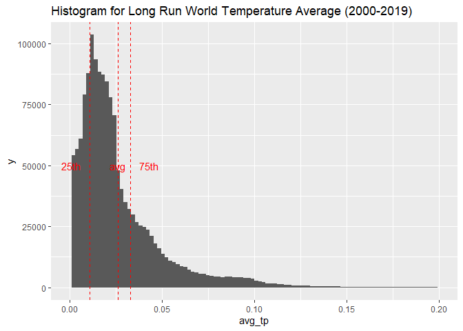

Code
================

# Precipitation data, cell level

## ERA5-Land monthly averaged data

Source: <https://doi.org/10.24381/cds.68d2bb30>

For precipitation data, I use the ERA5-Land dataset from Copernicus. It
provides “total precipitation” at grid cell level, with a resolution of
0.1°, and a monthly frequency from 2000 to 2019.

``` r
library(ncdf4)
library(terra)
```

    ## Warning: package 'terra' was built under R version 4.4.3

    ## terra 1.8.29

``` r
# 1) Load data

filename <- "../data/total_precipitation.nc"
nc <- nc_open(filename)

# Load latitude and longitude
lat <- ncvar_get(nc, "latitude") # 1801
lon <- ncvar_get(nc, "longitude") # 3600

lon <- ifelse(lon > 180, lon - 360, lon) # Center Europe
lon_order <- order(lon) 
lon <- lon[lon_order] # Reorder starting from the "new" 0

time <- ncvar_get(nc, "valid_time") # Read time: 12 months * 20 years = 240 months
dates <- as.POSIXct(time, origin = "1970-01-01", tz = "UTC") # Convert from seconds to date
years <- format(dates, "%Y")
years_unique <- unique(years) # 2000-2019

# Read precipitations
tp <- ncvar_get(nc, "tp") # Three dimensions: [lon, lat, time]
tp <- tp[lon_order,,]

nc_close(nc)
rm(nc) # free memory
gc() # free memory
```

    ##              used    (Mb) gc trigger    (Mb)   max used    (Mb)
    ## Ncells    1254195    67.0    2160877   115.5    2160877   115.5
    ## Vcells 1557834974 11885.4 4486614746 34230.2 3113962176 23757.7

``` r
# 2) Create rasters and compute year average

dir.create("tp_year_rasters", showWarnings = FALSE) # Create folder

# Loop years
for (j in seq_along(years_unique)) {
  yr <- years_unique[j]
  print(yr)
  idx <- which(years == yr) # Subset months with year

  month_rasters <- vector("list", length(idx))

  for (k in seq_along(idx)) {
    print(k)

    # Create a raster for each month
    r <- rast(t(tp[,,idx[k]]))
    ext(r) <- ext(min(lon), max(lon), min(lat), max(lat)) # Set Extent
    crs(r) <- "EPSG:4326" # Set CRS WGS84

    # Remove Antarctica: below -60°
    r <- crop(r, ext(min(lon), max(lon), -60, max(lat)))

    month_rasters[[k]] <- r
  }

  # Compute year mean
  yearly_raster <- mean(rast(month_rasters), na.rm = TRUE)
  
  # Name the raster layer with the year
  names(yearly_raster) <- paste0("tp_", yr)
  
  writeRaster(yearly_raster, sprintf("tp_year_rasters/year_%s.tif", yr), overwrite = TRUE)

  rm(month_rasters) # free memory
  gc() # free memory
}
```

    ## [1] "2000"
    ## [1] 1
    ## [1] 2
    ## [1] 3
    ## [1] 4
    ## [1] 5
    ## [1] 6
    ## [1] 7
    ## [1] 8
    ## [1] 9
    ## [1] 10
    ## [1] 11
    ## [1] 12
    ## [1] "2001"
    ## [1] 1
    ## [1] 2
    ## [1] 3
    ## [1] 4
    ## [1] 5
    ## [1] 6
    ## [1] 7
    ## [1] 8
    ## [1] 9
    ## [1] 10
    ## [1] 11
    ## [1] 12
    ## [1] "2002"
    ## [1] 1
    ## [1] 2
    ## [1] 3
    ## [1] 4
    ## [1] 5
    ## [1] 6
    ## [1] 7
    ## [1] 8
    ## [1] 9
    ## [1] 10
    ## [1] 11
    ## [1] 12
    ## [1] "2003"
    ## [1] 1
    ## [1] 2
    ## [1] 3
    ## [1] 4
    ## [1] 5
    ## [1] 6
    ## [1] 7
    ## [1] 8
    ## [1] 9
    ## [1] 10
    ## [1] 11
    ## [1] 12
    ## [1] "2004"
    ## [1] 1
    ## [1] 2
    ## [1] 3
    ## [1] 4
    ## [1] 5
    ## [1] 6
    ## [1] 7
    ## [1] 8
    ## [1] 9
    ## [1] 10
    ## [1] 11
    ## [1] 12
    ## [1] "2005"
    ## [1] 1
    ## [1] 2
    ## [1] 3
    ## [1] 4
    ## [1] 5
    ## [1] 6
    ## [1] 7
    ## [1] 8
    ## [1] 9
    ## [1] 10
    ## [1] 11
    ## [1] 12
    ## [1] "2006"
    ## [1] 1
    ## [1] 2
    ## [1] 3
    ## [1] 4
    ## [1] 5
    ## [1] 6
    ## [1] 7
    ## [1] 8
    ## [1] 9
    ## [1] 10
    ## [1] 11
    ## [1] 12
    ## [1] "2007"
    ## [1] 1
    ## [1] 2
    ## [1] 3
    ## [1] 4
    ## [1] 5
    ## [1] 6
    ## [1] 7
    ## [1] 8
    ## [1] 9
    ## [1] 10
    ## [1] 11
    ## [1] 12
    ## [1] "2008"
    ## [1] 1
    ## [1] 2
    ## [1] 3
    ## [1] 4
    ## [1] 5
    ## [1] 6
    ## [1] 7
    ## [1] 8
    ## [1] 9
    ## [1] 10
    ## [1] 11
    ## [1] 12
    ## [1] "2009"
    ## [1] 1
    ## [1] 2
    ## [1] 3
    ## [1] 4
    ## [1] 5
    ## [1] 6
    ## [1] 7
    ## [1] 8
    ## [1] 9
    ## [1] 10
    ## [1] 11
    ## [1] 12
    ## [1] "2010"
    ## [1] 1
    ## [1] 2
    ## [1] 3
    ## [1] 4
    ## [1] 5
    ## [1] 6
    ## [1] 7
    ## [1] 8
    ## [1] 9
    ## [1] 10
    ## [1] 11
    ## [1] 12
    ## [1] "2011"
    ## [1] 1
    ## [1] 2
    ## [1] 3
    ## [1] 4
    ## [1] 5
    ## [1] 6
    ## [1] 7
    ## [1] 8
    ## [1] 9
    ## [1] 10
    ## [1] 11
    ## [1] 12
    ## [1] "2012"
    ## [1] 1
    ## [1] 2
    ## [1] 3
    ## [1] 4
    ## [1] 5
    ## [1] 6
    ## [1] 7
    ## [1] 8
    ## [1] 9
    ## [1] 10
    ## [1] 11
    ## [1] 12
    ## [1] "2013"
    ## [1] 1
    ## [1] 2
    ## [1] 3
    ## [1] 4
    ## [1] 5
    ## [1] 6
    ## [1] 7
    ## [1] 8
    ## [1] 9
    ## [1] 10
    ## [1] 11
    ## [1] 12
    ## [1] "2014"
    ## [1] 1
    ## [1] 2
    ## [1] 3
    ## [1] 4
    ## [1] 5
    ## [1] 6
    ## [1] 7
    ## [1] 8
    ## [1] 9
    ## [1] 10
    ## [1] 11
    ## [1] 12
    ## [1] "2015"
    ## [1] 1
    ## [1] 2
    ## [1] 3
    ## [1] 4
    ## [1] 5
    ## [1] 6
    ## [1] 7
    ## [1] 8
    ## [1] 9
    ## [1] 10
    ## [1] 11
    ## [1] 12
    ## [1] "2016"
    ## [1] 1
    ## [1] 2
    ## [1] 3
    ## [1] 4
    ## [1] 5
    ## [1] 6
    ## [1] 7
    ## [1] 8
    ## [1] 9
    ## [1] 10
    ## [1] 11
    ## [1] 12
    ## [1] "2017"
    ## [1] 1
    ## [1] 2
    ## [1] 3
    ## [1] 4
    ## [1] 5
    ## [1] 6
    ## [1] 7
    ## [1] 8
    ## [1] 9
    ## [1] 10
    ## [1] 11
    ## [1] 12
    ## [1] "2018"
    ## [1] 1
    ## [1] 2
    ## [1] 3
    ## [1] 4
    ## [1] 5
    ## [1] 6
    ## [1] 7
    ## [1] 8
    ## [1] 9
    ## [1] 10
    ## [1] 11
    ## [1] 12
    ## [1] "2019"
    ## [1] 1
    ## [1] 2
    ## [1] 3
    ## [1] 4
    ## [1] 5
    ## [1] 6
    ## [1] 7
    ## [1] 8
    ## [1] 9
    ## [1] 10
    ## [1] 11
    ## [1] 12

``` r
rm(tp)
rm(r)
rm(yearly_raster)
gc()
```

    ##           used (Mb) gc trigger    (Mb)   max used    (Mb)
    ## Ncells 1264961 67.6    2160877   115.5    2160877   115.5
    ## Vcells 1798936 13.8 3589291797 27384.2 3113962176 23757.7

``` r
# 3) Yearly rasters

yearly_files <- list.files("tp_year_rasters", pattern = "\\.tif$", full.names = TRUE)

# Read all rasters into a stack
yearly_rasters <- rast(yearly_files)

r_2000 <- yearly_rasters[[1]]  # First raster (2000)
r_2019 <- yearly_rasters[[20]]  # Last raster (2019)

# Compute the overall average
avg_raster <- mean(yearly_rasters)

# Convert each raster to a dataframe
df_2000 <- as.data.frame(r_2000, xy = TRUE)
df_2019 <- as.data.frame(r_2019, xy = TRUE)
df_avg <- as.data.frame(avg_raster, xy = TRUE)

# Merge dataframes
df <- merge(df_2000, df_2019, by = c("x", "y"), suffixes = c("_2000", "_2019"))
df <- merge(df, df_avg, by = c("x", "y"))
colnames(df) <- c("x", "y", "tp_2000", "tp_2019", "avg_tp")
df$x <- round(df$x, 1)
df$y <- round(df$y, 1)

write.csv(df, "total_precipitation_summary.csv", row.names = FALSE)
```

``` r
library(ggplot2)
```

    ## Warning: package 'ggplot2' was built under R version 4.4.3

``` r
ggplot() + 
  geom_raster(data = df, mapping = aes(x = x, y = y, fill = avg_tp)) +
  coord_fixed() +
  scale_fill_viridis_b(name = "m", limits = c(0,0.015)) +
  ggtitle("All-time Avg Total Precipitations 2000-2019")
```

<!-- -->

``` r
ggplot() +
  geom_histogram(data = df, aes(x = tp_2000), 
                 fill = "steelblue", alpha = 0.5, bins = 100) +
  geom_histogram(data = df, aes(x = tp_2019), 
                 fill = "tomato", alpha = 0.5, bins = 100) +
  labs(x = "Total Precipitations (m)", y = "Count", title = "Histogram of Total Precipitations: 2000 vs 2019") +
  scale_x_continuous(limits = c(0, 0.025)) +
  guides(fill = guide_legend(title = "Year"))
```

    ## Warning: Removed 729 rows containing non-finite outside the scale range
    ## (`stat_bin()`).

    ## Warning: Removed 497 rows containing non-finite outside the scale range
    ## (`stat_bin()`).

    ## Warning: Removed 2 rows containing missing values or values outside the scale range
    ## (`geom_bar()`).
    ## Removed 2 rows containing missing values or values outside the scale range
    ## (`geom_bar()`).

<!-- -->
