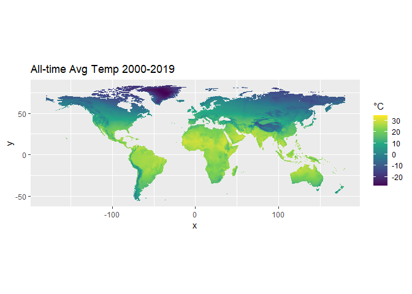
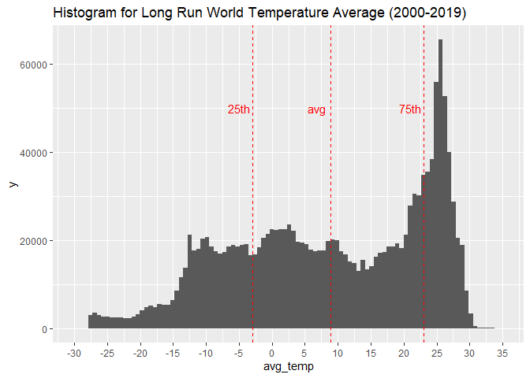
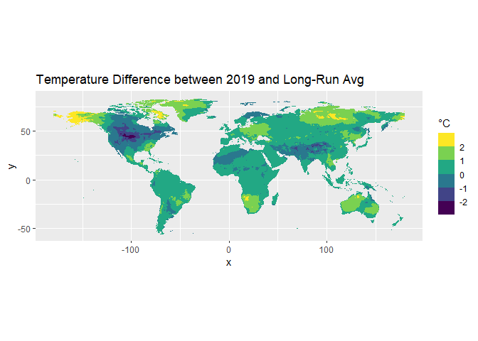
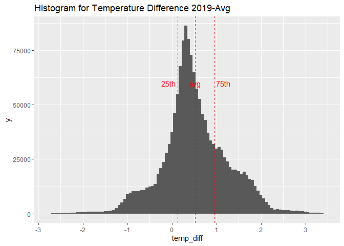
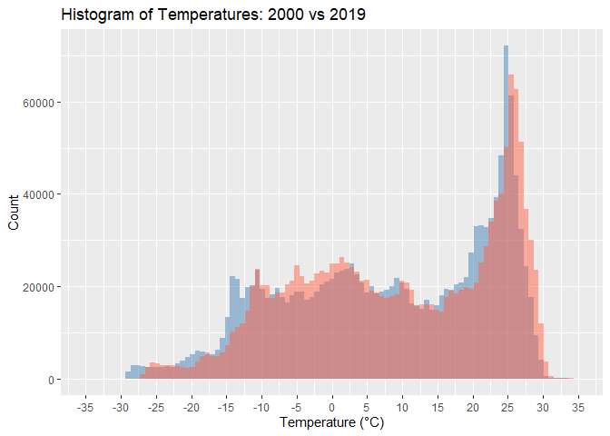

Code
================

# Temperature data, cell level

## ERA5-Land monthly averaged data

Source: <https://doi.org/10.24381/cds.68d2bb30>

For temperature data, I use the ERA5-Land dataset from Copernicus. It
provides “2m temperature” at grid cell level, with a resolution of 0.1°,
and a monthly frequency from 2000 to 2019.

Net-Migration and GDP data have a resolution of 0.083°. I downscale them
to a coarser resolution of 0.1° to match them with climate data.

``` r
library(ncdf4)
library(terra)
```

    ## Warning: package 'terra' was built under R version 4.4.3

    ## terra 1.8.29

``` r
# 1) Load data

filename <- "../data/2m_temperature.nc"
nc <- nc_open(filename)

# Load latitude and longitude
lat <- ncvar_get(nc, "latitude") # 1801
lon <- ncvar_get(nc, "longitude") # 3600

lon <- ifelse(lon > 180, lon - 360, lon) # Center Europe
lon_order <- order(lon) 
lon <- lon[lon_order] # Reorder starting from the "new" 0

time <- ncvar_get(nc, "valid_time") # Read time: 12 months * 20 years = 240 months
dates <- as.POSIXct(time, origin = "1970-01-01", tz = "UTC") # Convert from seconds to date
years <- format(dates, "%Y")
years_unique <- unique(years) # 2000-2019

# Read temperature
temp_k <- ncvar_get(nc, "t2m")  # Three dimensions: [lon, lat, time]
temp_c <- temp_k[lon_order, , ] - 273.15  # Reoder and convert from Kelvin to Celsius

nc_close(nc)
rm(nc) # free memory
rm(temp_k) # free memory
gc() # free memory
```

    ##              used    (Mb) gc trigger    (Mb)   max used    (Mb)
    ## Ncells    1254487    67.0    2161441   115.5    2161441   115.5
    ## Vcells 1557836392 11885.4 4486616787 34230.2 3113981579 23757.8

``` r
# 2) Create rasters and compute year average

dir.create("temp_year_rasters", showWarnings = FALSE) # Create folder

# Loop years
for (j in seq_along(years_unique)) {
  yr <- years_unique[j]
  print(yr)
  idx <- which(years == yr) # Subset months with year

  month_rasters <- vector("list", length(idx))

  for (k in seq_along(idx)) {
    print(k)

    # Create a raster for each month
    r <- rast(t(temp_c[,,idx[k]]))
    ext(r) <- ext(min(lon), max(lon), min(lat), max(lat)) # Set Extent
    crs(r) <- "EPSG:4326" # Set CRS WGS84

    # Remove Antarctica: below -60°
    r <- crop(r, ext(min(lon), max(lon), -60, max(lat)))

    month_rasters[[k]] <- r
  }

  # Compute year mean
  yearly_raster <- mean(rast(month_rasters), na.rm = TRUE)
  
  # Global mean temperature for the year
  mean_value <- global(yearly_raster, fun = "mean", na.rm = TRUE)[1,1]
  cat("Year:", yr, "- Mean temp (°C):", round(mean_value, 2), "\n")
  
  # Name the raster layer with the year
  names(yearly_raster) <- paste0("temp_", yr)
  
  writeRaster(yearly_raster, sprintf("temp_year_rasters/year_%s.tif", yr), overwrite = TRUE)

  rm(month_rasters) # free memory
  gc() # free memory
}
```

    ## [1] "2000"
    ## [1] 1
    ## [1] 2
    ## [1] 3
    ## [1] 4
    ## [1] 5
    ## [1] 6
    ## [1] 7
    ## [1] 8
    ## [1] 9
    ## [1] 10
    ## [1] 11
    ## [1] 12
    ## Year: 2000 - Mean temp (°C): 8.27 
    ## [1] "2001"
    ## [1] 1
    ## [1] 2
    ## [1] 3
    ## [1] 4
    ## [1] 5
    ## [1] 6
    ## [1] 7
    ## [1] 8
    ## [1] 9
    ## [1] 10
    ## [1] 11
    ## [1] 12
    ## Year: 2001 - Mean temp (°C): 8.53 
    ## [1] "2002"
    ## [1] 1
    ## [1] 2
    ## [1] 3
    ## [1] 4
    ## [1] 5
    ## [1] 6
    ## [1] 7
    ## [1] 8
    ## [1] 9
    ## [1] 10
    ## [1] 11
    ## [1] 12
    ## Year: 2002 - Mean temp (°C): 8.66 
    ## [1] "2003"
    ## [1] 1
    ## [1] 2
    ## [1] 3
    ## [1] 4
    ## [1] 5
    ## [1] 6
    ## [1] 7
    ## [1] 8
    ## [1] 9
    ## [1] 10
    ## [1] 11
    ## [1] 12
    ## Year: 2003 - Mean temp (°C): 8.75 
    ## [1] "2004"
    ## [1] 1
    ## [1] 2
    ## [1] 3
    ## [1] 4
    ## [1] 5
    ## [1] 6
    ## [1] 7
    ## [1] 8
    ## [1] 9
    ## [1] 10
    ## [1] 11
    ## [1] 12
    ## Year: 2004 - Mean temp (°C): 8.48 
    ## [1] "2005"
    ## [1] 1
    ## [1] 2
    ## [1] 3
    ## [1] 4
    ## [1] 5
    ## [1] 6
    ## [1] 7
    ## [1] 8
    ## [1] 9
    ## [1] 10
    ## [1] 11
    ## [1] 12
    ## Year: 2005 - Mean temp (°C): 9.02 
    ## [1] "2006"
    ## [1] 1
    ## [1] 2
    ## [1] 3
    ## [1] 4
    ## [1] 5
    ## [1] 6
    ## [1] 7
    ## [1] 8
    ## [1] 9
    ## [1] 10
    ## [1] 11
    ## [1] 12
    ## Year: 2006 - Mean temp (°C): 8.85 
    ## [1] "2007"
    ## [1] 1
    ## [1] 2
    ## [1] 3
    ## [1] 4
    ## [1] 5
    ## [1] 6
    ## [1] 7
    ## [1] 8
    ## [1] 9
    ## [1] 10
    ## [1] 11
    ## [1] 12
    ## Year: 2007 - Mean temp (°C): 9.02 
    ## [1] "2008"
    ## [1] 1
    ## [1] 2
    ## [1] 3
    ## [1] 4
    ## [1] 5
    ## [1] 6
    ## [1] 7
    ## [1] 8
    ## [1] 9
    ## [1] 10
    ## [1] 11
    ## [1] 12
    ## Year: 2008 - Mean temp (°C): 8.76 
    ## [1] "2009"
    ## [1] 1
    ## [1] 2
    ## [1] 3
    ## [1] 4
    ## [1] 5
    ## [1] 6
    ## [1] 7
    ## [1] 8
    ## [1] 9
    ## [1] 10
    ## [1] 11
    ## [1] 12
    ## Year: 2009 - Mean temp (°C): 8.63 
    ## [1] "2010"
    ## [1] 1
    ## [1] 2
    ## [1] 3
    ## [1] 4
    ## [1] 5
    ## [1] 6
    ## [1] 7
    ## [1] 8
    ## [1] 9
    ## [1] 10
    ## [1] 11
    ## [1] 12
    ## Year: 2010 - Mean temp (°C): 9.07 
    ## [1] "2011"
    ## [1] 1
    ## [1] 2
    ## [1] 3
    ## [1] 4
    ## [1] 5
    ## [1] 6
    ## [1] 7
    ## [1] 8
    ## [1] 9
    ## [1] 10
    ## [1] 11
    ## [1] 12
    ## Year: 2011 - Mean temp (°C): 8.76 
    ## [1] "2012"
    ## [1] 1
    ## [1] 2
    ## [1] 3
    ## [1] 4
    ## [1] 5
    ## [1] 6
    ## [1] 7
    ## [1] 8
    ## [1] 9
    ## [1] 10
    ## [1] 11
    ## [1] 12
    ## Year: 2012 - Mean temp (°C): 8.89 
    ## [1] "2013"
    ## [1] 1
    ## [1] 2
    ## [1] 3
    ## [1] 4
    ## [1] 5
    ## [1] 6
    ## [1] 7
    ## [1] 8
    ## [1] 9
    ## [1] 10
    ## [1] 11
    ## [1] 12
    ## Year: 2013 - Mean temp (°C): 8.81 
    ## [1] "2014"
    ## [1] 1
    ## [1] 2
    ## [1] 3
    ## [1] 4
    ## [1] 5
    ## [1] 6
    ## [1] 7
    ## [1] 8
    ## [1] 9
    ## [1] 10
    ## [1] 11
    ## [1] 12
    ## Year: 2014 - Mean temp (°C): 8.84 
    ## [1] "2015"
    ## [1] 1
    ## [1] 2
    ## [1] 3
    ## [1] 4
    ## [1] 5
    ## [1] 6
    ## [1] 7
    ## [1] 8
    ## [1] 9
    ## [1] 10
    ## [1] 11
    ## [1] 12
    ## Year: 2015 - Mean temp (°C): 9.18 
    ## [1] "2016"
    ## [1] 1
    ## [1] 2
    ## [1] 3
    ## [1] 4
    ## [1] 5
    ## [1] 6
    ## [1] 7
    ## [1] 8
    ## [1] 9
    ## [1] 10
    ## [1] 11
    ## [1] 12
    ## Year: 2016 - Mean temp (°C): 9.5 
    ## [1] "2017"
    ## [1] 1
    ## [1] 2
    ## [1] 3
    ## [1] 4
    ## [1] 5
    ## [1] 6
    ## [1] 7
    ## [1] 8
    ## [1] 9
    ## [1] 10
    ## [1] 11
    ## [1] 12
    ## Year: 2017 - Mean temp (°C): 9.3 
    ## [1] "2018"
    ## [1] 1
    ## [1] 2
    ## [1] 3
    ## [1] 4
    ## [1] 5
    ## [1] 6
    ## [1] 7
    ## [1] 8
    ## [1] 9
    ## [1] 10
    ## [1] 11
    ## [1] 12
    ## Year: 2018 - Mean temp (°C): 9.04 
    ## [1] "2019"
    ## [1] 1
    ## [1] 2
    ## [1] 3
    ## [1] 4
    ## [1] 5
    ## [1] 6
    ## [1] 7
    ## [1] 8
    ## [1] 9
    ## [1] 10
    ## [1] 11
    ## [1] 12
    ## Year: 2019 - Mean temp (°C): 9.41

``` r
rm(temp_c)
rm(r)
rm(yearly_raster)
gc()
```

    ##           used (Mb) gc trigger    (Mb)   max used    (Mb)
    ## Ncells 1266871 67.7    2161441   115.5    2161441   115.5
    ## Vcells 1805321 13.8 3589293430 27384.2 3113981579 23757.8

``` r
# 3) Yearly rasters

yearly_files <- list.files("temp_year_rasters", pattern = "\\.tif$", full.names = TRUE)

# Read all rasters into a stack
yearly_rasters <- rast(yearly_files)

r_2000 <- yearly_rasters[[1]]  # First raster (2000)
r_2019 <- yearly_rasters[[20]]  # Last raster (2019)

# Compute the overall time average
time_avg_raster <- mean(yearly_rasters)

# Convert each raster to a dataframe
df_2000 <- as.data.frame(r_2000, xy = TRUE)
df_2019 <- as.data.frame(r_2019, xy = TRUE)
df_avg <- as.data.frame(time_avg_raster, xy = TRUE)

# Merge dataframes
df <- merge(df_2000, df_2019, by = c("x", "y"), suffixes = c("_2000", "_2019"))
df <- merge(df, df_avg, by = c("x", "y"))
colnames(df) <- c("x", "y", "temp_2000", "temp_2019", "avg_temp")
df$temp_diff <- df$temp_2019 - df$avg_temp # Temp. diff. between last year and long run avg
df$x <- round(df$x, 1)
df$y <- round(df$y, 1)

write.csv(df, "temperature_summary.csv", row.names = FALSE)
```

``` r
library(ggplot2)
```

    ## Warning: package 'ggplot2' was built under R version 4.4.3

``` r
ggplot() + 
  geom_raster(data = df, mapping = aes(x = x, y = y, fill = avg_temp)) +
  coord_fixed() +
  scale_fill_viridis_c(name = "°C") +
  ggtitle("All-time Avg Temp 2000-2019")
```

<!-- -->

Summary Stats for Long Run Temperature average

``` r
# Summary Stats

q1_temp <- quantile(df$avg_temp, 0.25)
q3_temp <- quantile(df$avg_temp, 0.75)
avg_temp <- mean(df$avg_temp)

summary(df$avg_temp)
```

    ##    Min. 1st Qu.  Median    Mean 3rd Qu.    Max. 
    ## -27.806  -2.944   9.706   8.889  22.979  34.822

Distribution for Long Run Temperature average

``` r
ggplot() +
  geom_histogram(data = df, mapping = aes(avg_temp), bins=100) +
  scale_x_continuous(limits = c(-30, 35), breaks = seq(-30, 35, 5)) +
  
  geom_vline(xintercept = q1_temp, color = "red", linetype=2) + 
  annotate("text", x = q1_temp-2, y=50000, label = "25th", color="red") +
  
  geom_vline(xintercept = avg_temp, color = "red", linetype=2) + 
  annotate("text", x = avg_temp-2, y=50000, label = "avg", color="red") +
  
  geom_vline(xintercept = q3_temp, color = "red", linetype=2) + 
  annotate("text", x = q3_temp-2, y=50000, label = "75th", color="red") +
  
  ggtitle("Histogram for Long Run World Temperature Average (2000-2019)")
```

    ## Warning: Removed 2 rows containing missing values or values outside the scale range
    ## (`geom_bar()`).

<!-- -->

``` r
ggplot() + 
  geom_raster(data = df, mapping = aes(x = x, y = y, fill = temp_diff)) +
  coord_fixed() +
  scale_fill_viridis_b(name = "°C", breaks = seq(-2, 2, 1)) +
  ggtitle("Temperature Difference between 2019 and Long-Run Avg")
```

<!-- -->

Distribution of the temperature difference between 2019 and the long-run
average. The mean difference is +0.5°C, indicating a general warming.
The interquartile range (25th–75th percentile) is entirely above zero,
suggesting that the majority of observations experienced above-average
temperatures in 2019.

``` r
# Summary Stats

q1_temp <- quantile(df$temp_diff, 0.25)
q3_temp <- quantile(df$temp_diff, 0.75)
avg_temp <- mean(df$temp_diff)

summary(df$temp_diff)
```

    ##    Min. 1st Qu.  Median    Mean 3rd Qu.    Max. 
    ## -2.7611  0.1240  0.4419  0.5181  0.9470  3.4147

``` r
ggplot() +
  geom_histogram(data = df, mapping = aes(temp_diff), bins=100) +
  scale_x_continuous(breaks = seq(-3, 3, 1)) +
  
  geom_vline(xintercept = q1_temp, color = "red", linetype=2) + 
  annotate("text", x = q1_temp-.2, y=60000, label = "25th", color="red") +
  
  geom_vline(xintercept = avg_temp, color = "red", linetype=2) + 
  annotate("text", x = avg_temp, y=60000, label = "avg", color="red") +
  
  geom_vline(xintercept = q3_temp, color = "red", linetype=2) + 
  annotate("text", x = q3_temp+.2, y=60000, label = "75th", color="red") +
  
  ggtitle("Histogram for Temperature Difference 2019-Avg")
```

<!-- -->

``` r
library(patchwork)
```

    ## Warning: package 'patchwork' was built under R version 4.4.3

    ## 
    ## Attaching package: 'patchwork'

    ## The following object is masked from 'package:terra':
    ## 
    ##     area

``` r
# Compute common limits
temp_min <- min(df$temp_2000, df$temp_2019, na.rm = TRUE)
temp_max <- max(df$temp_2000, df$temp_2019, na.rm = TRUE)

p1 <- ggplot() + 
  geom_raster(data = df, mapping = aes(x = x, y = y, fill = temp_2000)) +
  coord_fixed() +
  scale_fill_viridis_c(name = "°C", limits = c(temp_min, temp_max)) +
  ggtitle("Avg Temp 2000")

p2 <- ggplot() + 
  geom_raster(data = df, mapping = aes(x = x, y = y, fill = temp_2019)) +
  coord_fixed() +
  scale_fill_viridis_c(name = "°C", limits = c(temp_min, temp_max)) +
  ggtitle("Avg Temp 2019")

p1 + p2 + plot_layout(ncol = 1)
```

<!-- -->

Distribution of temperature in 2000 vs. 2019. The 2019 distribution is
clearly shifted to the right, indicating generally higher temperatures
compared to 2000. However, since these are single-year snapshots, they
may reflect anomalous conditions and should be interpreted with caution.

``` r
ggplot() +
  geom_histogram(data = df, aes(x = temp_2000), 
                 fill = "steelblue", alpha = 0.5, bins = 100) +
  geom_histogram(data = df, aes(x = temp_2019), 
                 fill = "tomato", alpha = 0.5, bins = 100) +
  labs(x = "Temperature (°C)", y = "Count", title = "Histogram of Temperatures: 2000 vs 2019") +
  scale_x_continuous(limits = c(-35, 35), breaks = seq(-35, 35, 5)) +
  guides(fill = guide_legend(title = "Year"))
```

    ## Warning: Removed 1 row containing non-finite outside the scale range
    ## (`stat_bin()`).

    ## Warning: Removed 2 rows containing missing values or values outside the scale range
    ## (`geom_bar()`).
    ## Removed 2 rows containing missing values or values outside the scale range
    ## (`geom_bar()`).

<!-- -->
