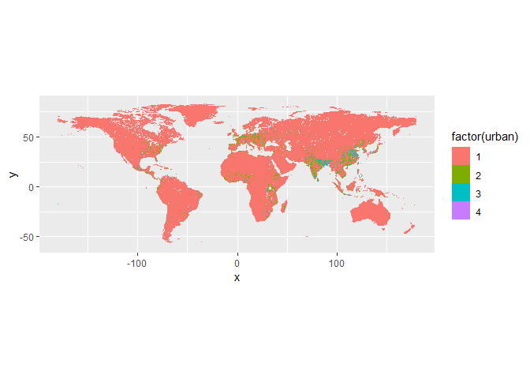
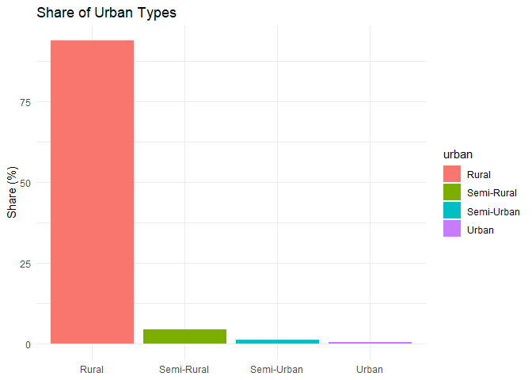

Code
================

# Urban-Rural data, cell-level

## Global Human Settlement - Degree of Urbanisation (GHS-SMOD)

Source:
<https://human-settlement.emergency.copernicus.eu/ghs_smod2023.php>

Another fundamental piece of information for my analysis is the level of
urbanization of each cell. In addition to the fact that most migrations
occur from low-GDP to high-GDP countries, most migrations also originate
in rural areas and point to urban areas.

Peri (2019) clusters cells based on the population density distribution
for each country, creating four groups: rural, semi-rural, semi-urban,
and urban. However, using only population density to categorize cell
types is not ideal. For example, population density alone doesn’t
account for other key factors, such as economic activity or the built-up
area in the cell, which are essential for correctly classifying a cell.

To this end, the European JRC have built a dataset to comprehensively
cluster cells into 8 categories, following the Degree of Urbanisation
(European Commission & Statistical Office). To do so, they use data from
two dataset: GHS-POP and GHS-BUILT-S.

- 30: URBAN CENTRE
- 23: DENSE URBAN
- 22: SEMI-DENSE URBAN
- 21: SUBURBAN
- 13: RURAL
- 12: LOW DENSITY RURAL
- 11: VERY LOW DENSITY RURAL
- 10: WATER

To stick to the usual four clusters/quartiles methodology, and to
reproduce Peri (2019), I re-classify the categories as follow:

- URBAN: 30, 23
- SEMI-URBAN: 22, 21
- SEMI-RURAL: 13, 12
- RURAL: 11
- Water cells are removed

Additionally, the JRC provides data at five-year intervals from 2000 to
2020. Rather than arbitrarily selecting a single observation (e.g., the
oldest), I decide to assign the mode of the data to each cell for more
consistent categorization.

``` r
library(terra)
```

    ## Warning: package 'terra' was built under R version 4.4.3

    ## terra 1.8.29

``` r
library(ggplot2)
```

    ## Warning: package 'ggplot2' was built under R version 4.4.3

``` r
library(viridis)
```

    ## Warning: package 'viridis' was built under R version 4.4.3

    ## Loading required package: viridisLite

``` r
# 1. Load the 5 SMOD rasters into a SpatRaster stack
files <- c(
  "GHS_SMOD_E2000_GLOBE_R2023A_4326_30ss_V2_0.tif",
  "GHS_SMOD_E2005_GLOBE_R2023A_4326_30ss_V2_0.tif",
  "GHS_SMOD_E2010_GLOBE_R2023A_4326_30ss_V2_0.tif",
  "GHS_SMOD_E2015_GLOBE_R2023A_4326_30ss_V2_0.tif",
  "GHS_SMOD_E2020_GLOBE_R2023A_4326_30ss_V2_0.tif"
)
stack <- rast(file.path("../data/GHS_SMOD/", files))

# 2. Compute pixel-wise mode across the 5 years
mode <- modal(stack, na.rm = TRUE)
```

    ## |---------|---------|---------|---------|=========================================                                          

``` r
# 3. Reclassify values into your four categories
# 30 → 4 (URBAN)
# 23, 22 → 3 (SEMI-URBAN)
# 21, 13 → 2 (SEMI-RURAL)
# 12, 11 → 1 (RURAL)
# 10 (WATER) → NA

rcl <- matrix(c(
  30, 4,
  23, 4,
  22, 3,
  21, 3,
  13, 2,
  12, 2,
  11, 1,
  10, NA
), ncol = 2, byrow = TRUE)

class <- classify(mode, rcl)
```

    ## |---------|---------|---------|---------|=========================================                                          

``` r
# Define target raster with 0.1 degree resolution
target_res <- 0.1
target_raster <- rast(ext(class), resolution = target_res, crs = crs(class))

# Nearest neighbor keeps the original class values intact by assigning each output cell the value of the closest input cell, preserving the discrete categories
downscaled <- resample(class, target_raster, method = "near")

# Define extent excluding Antarctica
e_no_antarctica <- ext(xmin(downscaled), xmax(downscaled), -60, ymax(downscaled))

# Crop the downscaled raster
downscaled <- crop(downscaled, e_no_antarctica)

df <- as.data.frame(downscaled, xy = TRUE, na.rm = TRUE)
names(df)[3] <- "urban"

# Remove rows where urban == 0
df <- df[df$urban != 0, ]

ggplot() + 
  geom_raster(data  = df, mapping = aes(x = x, y = y, fill = factor(urban))) +
  coord_fixed()
```

    ## Warning: Raster pixels are placed at uneven horizontal intervals and will be shifted
    ## ℹ Consider using `geom_tile()` instead.

<!-- -->

MERGE WITH INCOME DATA: CROSS-CROSS

``` r
library(terra)

# Load the income raster stack
income_stack <- rast("income-gdp-stack.tif")

# Convert income raster to points
income_points <- as.points(income_stack, na.rm = TRUE)

# Extract urban values at income point locations
urban_values <- extract(downscaled, income_points, method = "simple")

# Combine the data
# income_points already contains the coordinates and income data
# urban_values contains the ID and urban classification
df_merged <- as.data.frame(income_points, geom = "XY")
df_merged$urban <- urban_values[,2]

# Clean
df_merged <- df_merged[!is.na(df_merged$urban),]
df_merged <- df_merged[df_merged$urban > 0,]

# Reorder cols
df_merged <- df_merged[,c(3,4,1,2,5)]

table(df_merged$gdp_quartile)
```

    ## 
    ##      1      2      3      4 
    ## 356491 361202 352395 329666

ASSIGN COUNTRY CODE

``` r
library(rnaturalearth)
```

    ## Warning: package 'rnaturalearth' was built under R version 4.4.3

``` r
library(sf)
```

    ## Linking to GEOS 3.12.2, GDAL 3.9.3, PROJ 9.4.1; sf_use_s2() is TRUE

``` r
library(FNN)
```

    ## Warning: package 'FNN' was built under R version 4.4.3

``` r
# 1. Load world country polygons
world <- ne_countries(scale = "medium", returnclass = "sf")

# 2. Convert df_merged coordinates to sf object
coords_sf <- st_as_sf(
  df_merged[, c("x", "y")], 
  coords = c("x", "y"), 
  crs = 4326
)

# 3. Spatial join: assign ISO country code
country_match <- st_join(coords_sf, world[c("iso_a3_eh")], join = st_intersects)

# 4. Add country code to df_merged
df_merged$country_code <- country_match$iso_a3_eh

# 5. Handle missing values (cells not intersecting any country polygon)
na_mask <- is.na(df_merged$country_code)

if(sum(na_mask) > 0) {
  # Get centroids of countries
  country_centroids <- st_centroid(world)
  country_coords <- st_coordinates(country_centroids)
  
  # Get coordinates of unmatched cells
  na_coords <- as.matrix(df_merged[na_mask, c("x", "y")])
  
  # Find nearest country centroid for each NA point
  nn_idx <- get.knnx(country_coords, na_coords, k = 1)$nn.index[, 1]
  
  # Assign closest country code
  df_merged$country_code[na_mask] <- world$iso_a3_eh[nn_idx]
}
```

    ## Warning: st_centroid assumes attributes are constant over geometries

``` r
table(df_merged$country_code)
```

    ## 
    ##    ABW    AFG    AGO    ALA    ALB    AND    ARE    ARG    ARM    ASM    ATF 
    ##     13   6249  10348    153    304     19    154  27521    302      2     90 
    ##    ATG    AUS    AUT    AZE    BDI    BEL    BEN    BFA    BGD    BGR    BHR 
    ##      4  69473   1001    985    208    402    957   2266   1231   1251     19 
    ##    BHS    BIH    BLR    BLZ    BMU    BOL    BRA    BRB    BRN    BTN    BWA 
    ##    155    592   2798    209    114   9150  69970      4    100    364   5051 
    ##    CAF    CAN    CHE    CHL    CHN    CIV    CMR    COD    COG    COL    COM 
    ##   5046 159544    479   7488  94184   2628   3764  18731   2803   9185     35 
    ##    CPV    CRI    CUB    CUW    CYM    CYP    CZE    DEU    DJI    DMA    DNK 
    ##     33    433    946      9      6     67    988   4569    183      8    805 
    ##    DOM    DZA    ECU    EGY    ERI    ESH    ESP    EST    ETH    FIN    FJI 
    ##    412  21356   2072   9009   1039    828   5355    723   9212   6130    153 
    ##    FLK    FRA    FRO    FSM    GAB    GBR    GEO    GGY    GHA    GIN    GMB 
    ##    408   7122     50      6   2123   3278    770     27   1920   2009     84 
    ##    GNB    GNQ    GRC    GRD    GTM    GUY    HKG    HND    HRV    HTI    HUN 
    ##    290    232   1411      7    915   1720     24    939    634    241   1097 
    ##    IDN    IMN    IND    IRL    IRN    IRQ    ISL    ISR    ITA    JAM    JEY 
    ##  15019     74  27548    958  15545   4183   1948    229   3285     99     42 
    ##    JOR    JPN    KAZ    KEN    KGZ    KHM    KIR    KNA    KOR    KWT    LAO 
    ##    834   4095  32546   4734   2067   1488    156      4   1153    175   1957 
    ##    LBN    LBR    LBY    LCA    LIE    LKA    LSO    LTU    LUX    LVA    MAC 
    ##    102    775  14802      6      1    571    278    920     32    945     46 
    ##    MAR    MCO    MDA    MDG    MEX    MHL    MKD    MLI    MLT    MMR    MNE 
    ##   5421     20    396   5076  17293      1    269  10663     19   5753    149 
    ##    MNG    MOZ    MRT    MSR    MUS    MWI    MYS    NAM    NCL    NER    NFK 
    ##  18284   6612   8939      1     18    802   2665   7237     16  10059      7 
    ##    NGA    NIC    NLD    NOR    NPL    NRU    NZL    OMN    PAK    PAN    PER 
    ##   7467    998    468   8377   1349      1   2903   2690   8107    621  10546 
    ##    PHL    PLW    PNG    POL    PRI    PRK    PRT    PRY    PSE    QAT    ROU 
    ##   2492     45   3842   4103     80   1430    965   3522     56      4   2722 
    ##    RUS    RWA    SAU    SDN    SEN    SGP    SLB    SLE    SLV    SMR    SOM 
    ## 239781    193  17080  15665   1635    149    243    594    176      4   3828 
    ##    SPM    SRB    SSD    STP    SUR    SVK    SVN    SWE    SWZ    SXM    SYC 
    ##    535    878   5091     14   1327    588    241   7446    158      1      4 
    ##    SYR    TCA    TCD    TGO    THA    TJK    TKM    TLS    TON    TTO    TUN 
    ##   1828      5  10681    463   4341   1468   4840    270     13     81   1537 
    ##    TUR    TWN    TZA    UGA    UKR    URY    USA    UZB    VAT    VCT    VEN 
    ##   8030    435   7255   1676   6976   1693 108761   4746     15      5   7369 
    ##    VGB    VIR    VNM    VUT    WLF    WSM    YEM    ZAF    ZMB    ZWE 
    ##      3      5   2781    118      4     25   3818  11284   6180   3323

SUMMMARY STATISTICS

``` r
library(ggplot2)

# Define labels
urban_labels <- c("Rural", "Semi-Rural", "Semi-Urban", "Urban")

# Create summary table
urban_summary <- as.data.frame(table(df_merged$urban))
names(urban_summary) <- c("urban", "count")
urban_summary$urban <- factor(urban_summary$urban,
                              levels = 1:4,
                              labels = urban_labels)
urban_summary$share <- 100 * urban_summary$count / sum(urban_summary$count)

# Plot
ggplot(urban_summary, aes(x = urban, y = share, fill = urban)) +
  geom_col() +
  labs(
    title = "Share of Urban Types",
    x = NULL,
    y = "Share (%)"
  ) +
  theme_minimal()
```

<!-- -->

``` r
write.csv(df_merged, "urban-income.csv", row.names = FALSE)
```
